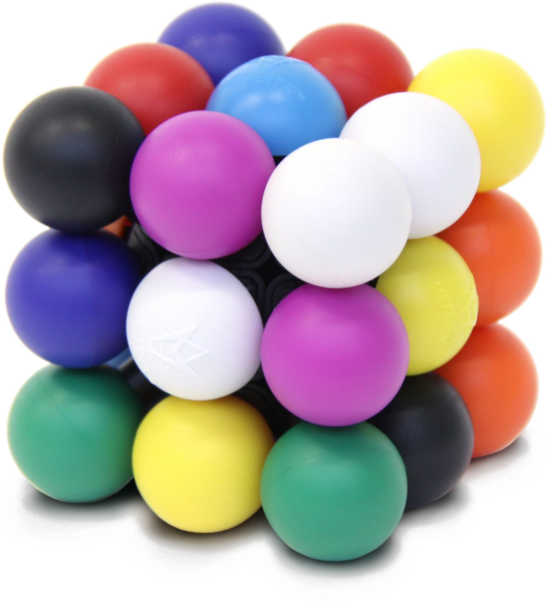

# What is this?

This project uses Vue, Vite, TailwindCSS, and a little bit of DaisyUI.

The goal was to create a UI replicating a Molecube.  
A molecube is a twisty puzzle, 6 faces, 8 corner balls, 12 edge balls.

After replicating the mechanics of the puzzle as a flattened plot, I then wanted to generate solutions.

My first attempt was to simply randomise all of the avaliable colours. That didn't work too well. The closest attempt only solving 4 sides.

After realising that updating the UI for every tested permutation was locking us to 16 tests per second (60fps), I made the rerolling system recurse immediately 1000 times before passing the 1001st recursion to `requestAnimationFrame`. That greatly increased the speed of the process while still keeping the page relatively responsive.

My following attempt pulled a permutation algorithm off stack overflow and used it to loop through the permutations of corners with an inner loop for permutations of the edges.

This attempt was also quite flawed, with there being no validation until the point that all of the colours were applied to the plot there was a lot of wasted processing. For example, knowing that any permuted corners that matched the face colour (defined by the static centre colour) then it could be immediately skipped, thereby skipping the entire edge permuting phase.

Applying the same logic to the edges also meant being able to quickly throw away a huge number of permutations without yielding them to the Molecube component for display and futher validation.

The result of that, however, was that the page locks up while hundreds of thousands of failed permutations are tested. However, as far as I can tell I was able to pull all 80 valid solutions from this implementation.

# What's next

I'm probably going to dump this project here. I've learnt some stuff, but I don't have much desire to refactor the code to make it a lot cleaner (things got really messy while I sped through my latest improvement ideas).

Some improvements I would make if I cared to:

- Learn how to move the permutation algs into a web worker
- Improve the alg to take into account certain features of the cube
  - Two green centres means they must be on opposite corners of the cube
  - Any corner / edge which shares a colour with a centre also have similar required positions
  - Work out why the permutation algs had so many duplicates
- Add buttons to view all of the found solutions
- Use CSS 3D transforms to make the cube cube-shaped + add click / drag handling to freely rotate it.
- Better page layout
- Actually update page title, icon, etc

--------------

